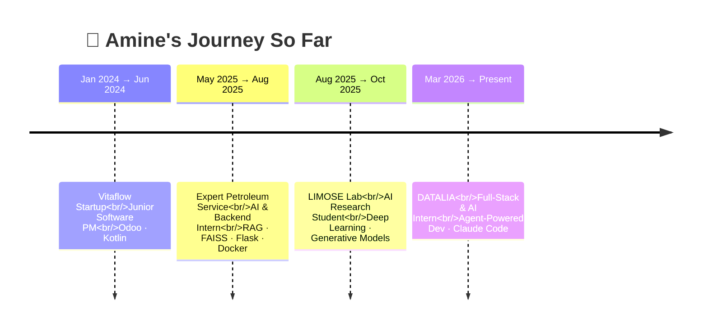

<!-- ╔══════════════════════════════════════════════════════════════════════╗ -->
<!-- ║                        ANIMATED HEADER BANNER                        ║ -->
<!-- ╚══════════════════════════════════════════════════════════════════════╝ -->

<div align="center">


<h2>Amine Boucif</h2>
<p><b>AI Engineer &bull; Full-Stack Developer &bull; RAG &amp; LLM Builder</b></p>

<br/>

<a href="https://git.io/typing-svg">
  
</a>

<br/>

<!-- Animated badges row -->
<a href="https://www.linkedin.com/in/amine-boucif-b82ab5247/"></a>
<a href="mailto:aminboucif22@gmail.com"></a>
<a href="https://www.amineboucif.com/"></a>
<a href="https://www.researchgate.net/profile/Amine-Boucif"></a>
<a href="https://github.com/Aminbcf"></a>

<br/><br/>


</div>


<!-- ╔══════════════════════════════════════════════════════════════════════╗ -->
<!-- ║                              ABOUT ME                                ║ -->
<!-- ╚══════════════════════════════════════════════════════════════════════╝ -->

##  About Me

<table>
<tr>
<td width="60%" valign="top">

```python
class AmineBoucif:
    def __init__(self):
        self.role        = "AI Engineer & Full-Stack Dev"
        self.location    = "Lens, France 🇫🇷"
        self.education   = "Licence Info @ Université d'Artois"
        self.previously  = "SE @ Université de Boumerdès"
        self.current     = "Full-Stack & AI Intern @ DATALIA"
        self.focus       = ["LLMs", "RAG", "Agents",
                            "Computer Vision"]
        self.languages   = {
            "English": "C2 (CEIL)",
            "French":  "Native 🥖",
            "Python":  "🐍 fluently"
        }
        self.fun_fact    = "I really like cats 🐈"

    def looking_for(self):
        return "✨ Alternance / End-of-studies internship ✨"

    def say_hi(self):
        print("Thanks for visiting — let's build something cool!")

me = AmineBoucif()
me.say_hi()
```

</td>
<td width="40%" valign="top" align="center">


<br/>

<sub><i>caffeine in, RAG pipelines out</i></sub>

</td>
</tr>
</table>

I build production-minded AI systems — from **multi-layer RAG pipelines** running on CPU-only hardware to **YOLO-based industrial defect detection**. I care about latency budgets, fallback strategies, and clean architectures (modular, hexagonal). Lately I've been deep into **agent-powered development** with Claude Code.

<!-- ╔══════════════════════════════════════════════════════════════════════╗ -->
<!-- ║                            TECH STACK                                ║ -->
<!-- ╚══════════════════════════════════════════════════════════════════════╝ -->

## 🛠️ Tech Stack

<div align="center">

#### 🤖 AI / ML / Deep Learning
<a href="#"></a>
<br/>


<br/>

#### ⚙️ Backend, Infra & Languages
<a href="#"></a>
<br/>
<a href="#"></a>

<br/>

#### 🎨 Frontend & Design
<a href="#"></a>

<br/>

#### 🤝 AI Agents I Vibe With


</div>

<!-- ╔══════════════════════════════════════════════════════════════════════╗ -->
<!-- ║                       EXPERIENCE TIMELINE                            ║ -->
<!-- ╚══════════════════════════════════════════════════════════════════════╝ -->

## 💼 Experience Timeline



<!-- ╔══════════════════════════════════════════════════════════════════════╗ -->
<!-- ║                         FEATURED PROJECTS                            ║ -->
<!-- ╚══════════════════════════════════════════════════════════════════════╝ -->

## 🚀 Featured Projects

<table>
<tr>
<td width="50%" valign="top">

### 🤖 [LLM-Polished-Version](https://github.com/Aminbcf/LLM-Polished-Version)
> A production-ready, lighter version of the LLM I built during my **Expert Petroleum Service** internship — multi-layer **RAG** with cache → semantic similarity → vector retrieval fallback, optimised for **CPU/RAM-constrained** environments.

`Python` · `RAG` · `FAISS` · `Flask` · `Docker`

<a href="https://github.com/Aminbcf/LLM-Polished-Version"></a>

</td>
<td width="50%" valign="top">

### 📄 [pdf-tool](https://github.com/Aminbcf/pdf-tool) ⭐
> Embedding-based text extraction from PDFs with **MCP integration** for PDF generation. One of my most-starred repos.

`JavaScript` · `MCP` · `Embeddings`

<a href="https://github.com/Aminbcf/pdf-tool"></a>

</td>
</tr>
<tr>
<td width="50%" valign="top">

### 🚦 [Traffic-Accident](https://github.com/Aminbcf/Trafic-Accicdent-)
> Predicting UK road accidents using ML/DL. Time-series feature engineering with **Lasso, Ridge, SVR, Prophet** — reached **R² up to 0.99**.

`Python` · `Prophet` · `Time-Series`

<a href="https://github.com/Aminbcf/Trafic-Accicdent-"></a>

</td>
<td width="50%" valign="top">

### 🧠 [AI](https://github.com/Aminbcf/AI)
> Fine-tuning playground for squeezing maximum precision and accuracy out of various models.

`Jupyter` · `Fine-Tuning`

<a href="https://github.com/Aminbcf/AI"></a>

</td>
</tr>
</table>

<!-- ╔══════════════════════════════════════════════════════════════════════╗ -->
<!-- ║                            GITHUB STATS                              ║ -->
<!-- ╚══════════════════════════════════════════════════════════════════════╝ -->

## 📊 GitHub Stats — Synthwave Edition

<div align="center">


<br/>


</div>

### 🐍 Watch the Snake Eat My Contributions

<div align="center">

<picture>
  <source media="(prefers-color-scheme: dark)" srcset="https://raw.githubusercontent.com/Aminbcf/Aminbcf/output/github-contribution-grid-snake-dark.svg" />
  <source media="(prefers-color-scheme: light)" srcset="https://raw.githubusercontent.com/Aminbcf/Aminbcf/output/github-contribution-grid-snake.svg" />
  
</picture>

</div>

### 🌐 Contribution Graph

<div align="center">


</div>

### 🏆 Trophies

<div align="center">


</div>

### 🧊 3D Contribution Cube

<div align="center">


</div>

<!-- ╔══════════════════════════════════════════════════════════════════════╗ -->
<!-- ║                      EDUCATION & CERTIFICATIONS                      ║ -->
<!-- ╚══════════════════════════════════════════════════════════════════════╝ -->

## 🎓 Education & Certifications

<table>
<tr>
<th>🏫 Institution</th>
<th>📚 Program</th>
<th>📅 Period</th>
</tr>
<tr><td><b>Université d'Artois</b></td><td>Licence Informatique (L3)</td><td>2025 — Present</td></tr>
<tr><td><b>Université de Boumerdès</b></td><td>Software Engineering (Cycle d'ingénierie)</td><td>2022 — 2025</td></tr>
<tr><td><b>Anthropic</b></td><td>🏆 <i>Claude Code in Action</i> — Agent-Powered Dev</td><td>2025</td></tr>
<tr><td><b>CEIL</b></td><td>English Certification — <b>C2</b></td><td>—</td></tr>
</table>

<!-- ╔══════════════════════════════════════════════════════════════════════╗ -->
<!-- ║                          DEV QUOTE                                   ║ -->
<!-- ╚══════════════════════════════════════════════════════════════════════╝ -->

## 💡 Random Dev Quote

<div align="center">


</div>

<!-- ╔══════════════════════════════════════════════════════════════════════╗ -->
<!-- ║                             CONNECT                                  ║ -->
<!-- ╚══════════════════════════════════════════════════════════════════════╝ -->

##  Let's Connect

<div align="center">

I'm **actively looking for an alternance or end-of-studies internship** in AI / Backend / Full-Stack.<br/>
If you're hiring or just want to chat about RAG, agents, or computer vision — my inbox is open.

<br/>

<a href="mailto:aminboucif22@gmail.com">
  
</a>
<a href="https://www.linkedin.com/in/amine-boucif-b82ab5247/">
  
</a>
<a href="https://www.amineboucif.com/">
  
</a>

<br/><br/>

<!-- Cute cat for the cat-lover -->


<br/>

<sub><i>(I told you I like cats 🐈)</i></sub>

</div>

<!-- ╔══════════════════════════════════════════════════════════════════════╗ -->
<!-- ║                          ANIMATED FOOTER                             ║ -->
<!-- ╚══════════════════════════════════════════════════════════════════════╝ -->


<div align="center">
<sub>⭐ From <a href="https://github.com/Aminbcf">Aminbcf</a> — built with caffeine, curiosity, and a lot of <code>Ctrl+S</code>.</sub>
</div>